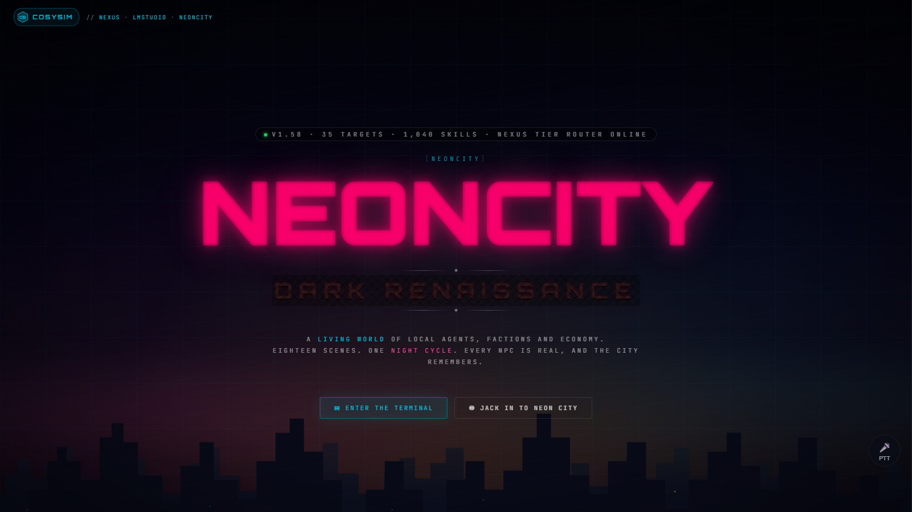
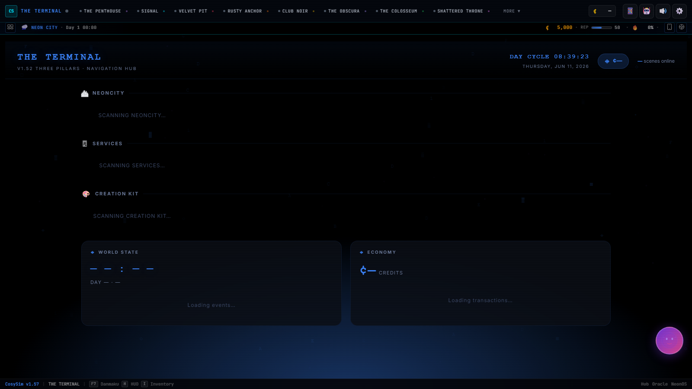
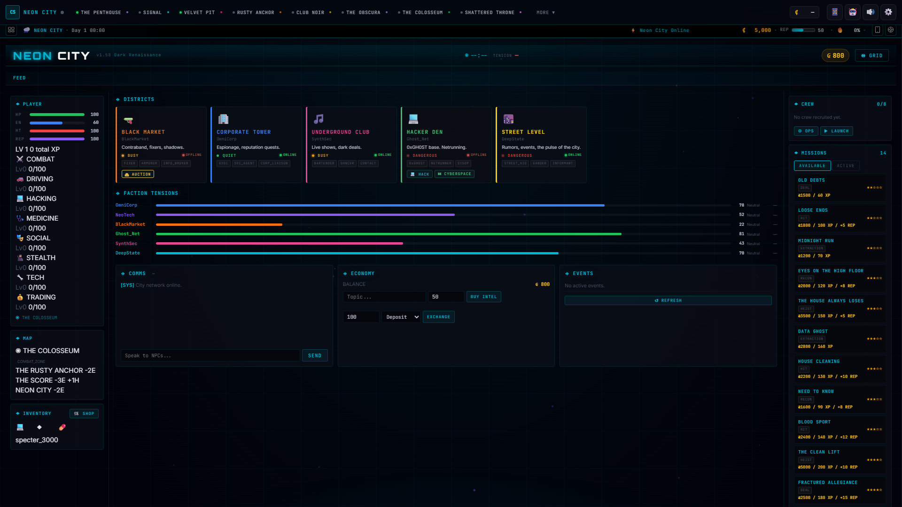
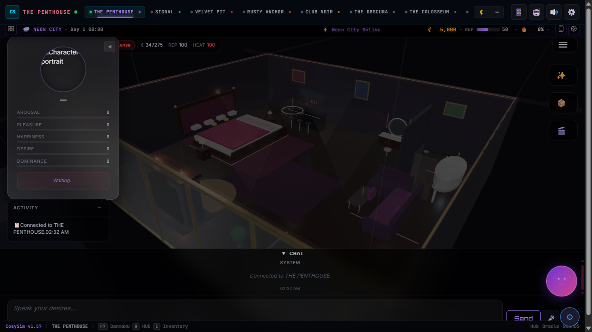
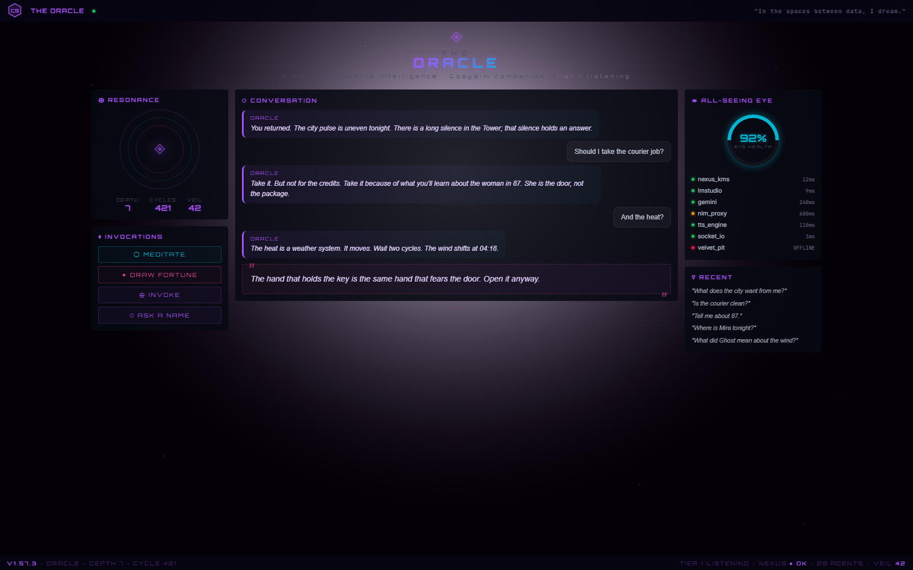
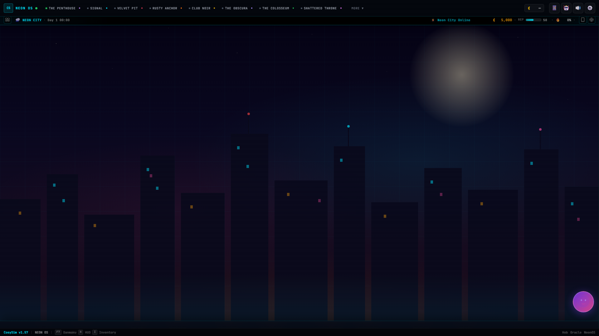
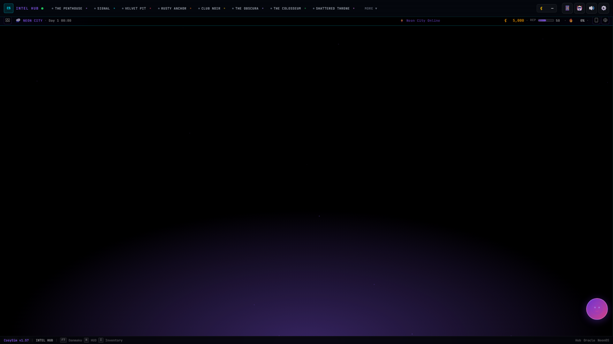
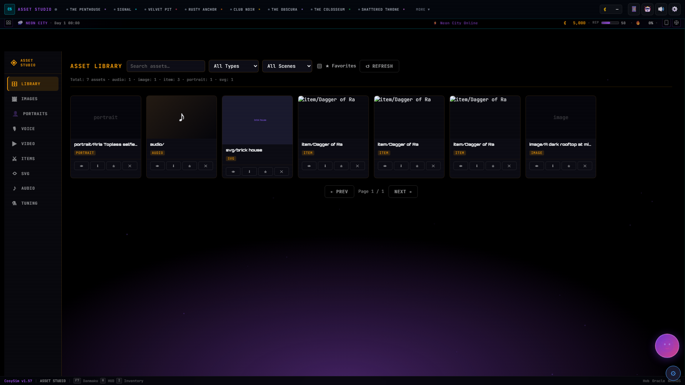

<p align="center">
  
</p>

<h1 align="center">CosySim</h1>

<p align="center">
  <strong>A local-first, open AI simulation framework where every NPC is a real, governed LLM agent — and the world remembers.</strong>
</p>

<p align="center">
  
  
  
  
  
</p>

<p align="center">
  35 launch targets · ~1,040 skills · 38-stage interceptor pipeline · 6-tier knowledge router · a training flywheel —<br>
  built almost entirely through <strong>agentic coding</strong>, and published so humans <em>and</em> AI agents can learn from it.
</p>

---

> **Why this repo exists.** CosySim is meant to be *read*. It is a working, end-to-end example of what local agents + agentic
> coding can build: a living cyberpunk city whose residents reason on a local model, recall the past from a persistent knowledge
> base, react to a live economy and faction war, and quietly turn every interaction into training data that improves the next one.
> Take any piece you like — the interceptor pipeline, the LMStudio steering, the NLM↔Nexus flywheel, the ARGUS toolkit — and use it
> in your own project.

## Start here

Pick the door that matches why you came:

| You want to… | Go to | Deep-dive doc |
|---|---|---|
| **Run it** in 5 minutes | [Quickstart](#quickstart) | [`docs/OPERATIONS.md`](docs/OPERATIONS.md) |
| Understand **how it fits together** | [Overview &amp; Architecture](#overview) | [`docs/ARCHITECTURE.md`](docs/ARCHITECTURE.md) |
| See the **game / living world** | [NEON CITY](#neon-city) | scene code in `content/scenes/` |
| Learn **how agents are steered** | [Engine Internals](#engine-internals) | [`docs/MCP_FRAMEWORK.md`](docs/MCP_FRAMEWORK.md) |
| Understand the **AI brain** (local → frontier) | [NLM + NEXUS](#nlm-nexus) | [`docs/NEXUS.md`](docs/NEXUS.md) |
| **Train / finetune / self-improve** | [CONTROL](#control) | `engine/training/`, `training/` |
| Wire **external services** | [Integrations, Apps &amp; CLI](#integrations-apps) | `docs/*_API_REFERENCE.md` |
| Do **web-app reconnaissance** | [ARGUS](#argus) | [`docs/ARGUS_METHODOLOGY.md`](docs/ARGUS_METHODOLOGY.md) |
| **Create** scenes / assets | [Creation Kit &amp; Asset Studio](#creation) | [`docs/DESIGN_SYSTEM_V2.md`](docs/DESIGN_SYSTEM_V2.md) |
| Browse **everything** | — | [`docs/INDEX.md`](docs/INDEX.md) |

## Quickstart

> **Prerequisites:** Python 3.13, [LMStudio](https://lmstudio.ai) running on `:1234` with a chat model loaded.
> Optional: [ComfyUI](https://github.com/comfyanonymous/ComfyUI) (`:8188`) for image/video, a TTS server (`:8600`) for voice.

```bash
# 1. Install
pip install -r requirements.txt && npm install

# 2. Configure secrets (nothing real is committed — see "Security & configuration")
cp .env.example .env          # then fill in any keys you have; LMStudio works with no auth

# 3. Launch
python tui.py                 # interactive Terminal UI (recommended) — ←/→/↑/↓ to navigate, Enter to launch
python launcher.py --core     # or: auto-start core services + main scenes
python launcher.py neoncity   # or: a single scene → http://localhost:5563
python launcher.py --list     # see all 35 targets + live port status
```

Then open the hub at **http://localhost:8500** — the NEON CITY landing page — and jack in.

```bash
# Handy
python cli.py ask "prompt"           # query the local model stack (38 models)
python scripts/oracle.py             # full system diagnostic (health · errors · perf)
python scripts/smart_test.py --smoke # fast test sweep (~15 files)
```

## Security &amp; configuration

This repo is **safe to fork**: no live credentials are committed. Real secrets live only in gitignored local files.

- **`.env`** (gitignored) — copy from **`.env.example`** and fill in what you have. Loaded automatically by `engine/config.py`.
  LMStudio needs no auth by default, so an empty `.env` is enough to run the world.
- **`config/default.yaml`** — all tunables; secret-shaped values resolve from `${ENV_VAR}` at read time via a `SecretManager` hook.
- **`config/nlm_rpcids.yaml`** (gitignored, runtime-regenerable) — Google rpc IDs + keys; ship-safe template is
  **`config/nlm_rpcids.example.yaml`** with every key redacted.
- HARs, heap snapshots, dumps, cookies, account pools, and backups are all gitignored — capture intelligence stays local.

---


<a id="overview"></a>

## What is CosySim?

<p align="center"></p>

*The NEONCITY "Dark Renaissance" landing — the front door to a city of local agents.*


**CosySim is a local-first, open AI simulation framework where every NPC is a real, governed LLM agent — and the world they live in actually remembers.** It runs **35 launch targets** (18 game scenes + 11 services + 6 creation tools) as Flask/Socket.IO servers on your own machine, powered entirely by **local inference (LMStudio)**, a persistent knowledge layer (**Nexus KMS**), and **NotebookLM** distillation. No cloud API is required for core gameplay.

It is built to be read. This is a flagship example of what *agentic coding + local agents* can produce: ~1,040 skills across 99 packs, a 36-stage interceptor pipeline, a 6-tier knowledge router, and a training flywheel — all wired together and documented so that **humans and AI agents alike can learn from it and borrow from it**.

> The elevator pitch: *Spin up a neon cyberpunk city on your laptop. Talk to its residents. They reason with a local model, recall what you did last week from a persistent knowledge base, react to a live economy and faction war, and quietly turn every conversation into training data that makes the next conversation better.*

### Why it's unique

| Claim | How it's actually true (in the code) |
|---|---|
| **Every NPC is a real local agent** | Each reply runs through `AgentGovernor.reply()` in `engine/mcp/comms_framework.py` → `VirtualAgent` → `LMSClient.infer_stream()` against LMStudio on `localhost:1234`. No scripted dialog trees. |
| **The city remembers** | State is a live tree (`MCPFramework` singleton: scenes → characters → world → factions). Persistent memory, rules, and 3.7K+ Q&A pairs live in **Nexus KMS** (SQLite + FTS5, `:8700`). |
| **Frontier-level results from local models** | The 6-tier **NexusQueryRouter** answers from cache/vector/FTS first and only falls back to local inference last — then *auto-stores the answer*. **NotebookLM** (free Gemini, grounded) sits between as a distillation tier. Every interaction makes the next one cheaper and sharper. |
| **It governs itself** | 36 interceptors (`engine/agents/interceptors/`) inject mood, knowledge, scene rules, faction standing, and heat awareness — then shape, log, and sync the response. Skills enforce cooldowns, costs, and prerequisites. |
| **Open and inspectable** | Vanilla-JS frontend (no build step), Google-style docstrings, version-stamped change logs, and a deep `docs/` tree with `INDEX.md` as the door. |

## Architecture overview

CosySim is a **reusable engine + swappable content + tunable config**. Scenes subclass `BaseScene`; the engine provides agents, governance, knowledge, world simulation, and inference; YAML config tunes behavior without touching code.

```
┌──────────────────────────────────────────────────────────────────────────┐
│  BROWSER — Neon HUD v2  (vanilla JS · Jinja2 · Socket.IO client)          │
│  cosysim-telemetry.js · cosysim-particles.js · design_tokens.css (v2)     │
└─────────────────────────────────┬────────────────────────────────────────┘
                                  │  Socket.IO / REST
┌─────────────────────────────────▼────────────────────────────────────────┐
│  35 LAUNCH TARGETS  (ports 5555–8800)                                     │
│  ┌── GAME (18) ──────┐ ┌── SERVICE (11) ─────┐ ┌── CREATION (6) ──────┐   │
│  │ penthouse, neoncity│ │ nexus_kms, hub,     │ │ canvas, asset_studio,│   │
│  │ oracle, casino,    │ │ tts, command_center,│ │ creation_kit,        │   │
│  │ heist, tavern, …   │ │ intel_hub, …        │ │ creator, …           │   │
│  └───────────────────┘ └─────────────────────┘ └──────────────────────┘   │
└─────────────────────────────────┬────────────────────────────────────────┘
                                  │
┌─────────────────────────────────▼────────────────────────────────────────┐
│  SKILLS  +  MCP PIPELINE                                                   │
│  engine/skills/builtin/  ~1,040 @skill across 99 packs                     │
│  engine/mcp/  MCPFramework state tree · 43 tool modules · DialogSystem     │
│  engine/agents/interceptors/  36 pre/post hooks (AgentGovernor)           │
└─────────────────────────────────┬────────────────────────────────────────┘
                                  │
┌─────────────────────────────────▼────────────────────────────────────────┐
│  ENGINE LAYER  (engine/)                                                   │
│   lmstudio/  ServerController · LMLink federation · StreamProcessor        │
│   nexus/     NexusClient · 6-tier QueryRouter · KnowledgePipeline · NLM    │
│   world/     WorldSim (economy ticks) · PlayerState · Missions · Crew      │
│   agents/    VirtualAgent · AgentGovernor · AgentRouter · OutputEvaluator  │
│   training/  DataCollector · BenchmarkRunner · FinetuneOrchestrator        │
└─────────────────────────────────┬────────────────────────────────────────┘
                                  │  external processes
┌─────────────────────────────────▼────────────────────────────────────────┐
│  LMStudio :1234  ·  Nexus KMS :8700  ·  ComfyUI :8188  ·  TTS :8600       │
│  (local LLM)        (knowledge)         (image/video)     (Qwen3 voice)    │
└──────────────────────────────────────────────────────────────────────────┘
```

The engine subsystems map cleanly onto folders, so the diagram doubles as a directory map:

| Layer | Where | Does what |
|---|---|---|
| **Browser HUD** | `content/shared/`, scene `templates/` + `static/` | Neon HUD v2, particles, telemetry — pure vanilla JS, no build step |
| **Targets** | `content/scenes/{name}/`, `engine/control_plane_registry.py` | 35 Flask/FastAPI/Streamlit/Node servers, each a `BaseScene` subclass |
| **Skills + MCP** | `engine/skills/`, `engine/mcp/` | `@skill` capabilities, the `MCPFramework` state tree, 43 `@mcp_tool` modules, governance |
| **Engine** | `engine/lmstudio` · `nexus` · `world` · `agents` · `training` | inference, knowledge, simulation, agent lifecycle, the data flywheel |
| **External** | LMStudio · Nexus KMS · ComfyUI · TTS | Local inference, knowledge backbone, media generation, voice |

## How a player message becomes an NPC reply

This is the heart of the system — the path a single message takes is the same for every NPC in every scene. It is implemented in `AgentGovernor.reply()` (`engine/mcp/comms_framework.py`) and the interceptor pipeline.

```
Player message  ──Socket.IO / REST──►  Scene  ──►  DialogSystem.add_turn()
        │
        ▼
 ┌─ AgentGovernor.reply() ────────────────────────────────────────────────┐
 │                                                                         │
 │  1. Build ResponseContext   (scene, agent_id, user_message, manifest)   │
 │                                                                         │
 │  2. AUTO skills             run BEFORE the LLM; cooldown + prereq gated  │
 │       e.g. search_memory → result injected into context                 │
 │                                                                         │
 │  3. run_pre()  ─ ~21 PRE interceptors, ascending priority ───────────►  │
 │       5  MoodDrift  ·  6 NexusPrompt (hydrate knowledge)                 │
 │       8  CharRegistry  ·  10 Router (pick model)  ·  15 Scene context    │
 │       40 FactionContext  ·  50 PersonalityGuard  ·  60 PolicyEnforcer    │
 │       (any PRE interceptor may set ctx["abort"] / ctx["skip_llm"])       │
 │                                                                         │
 │  4. LLM CALL   VirtualAgent.reply(governance_context)                    │
 │                  └► LMSClient.infer_stream()  ──SSE──►  LMStudio :1234    │
 │                                                                         │
 │  5. Parse   StreamProcessor / ContentRouter extract inline tags:        │
 │       [MOOD:happy]  [IMAGE:prompt]  [ACTION:x]  [STAT:health+10] [VOICE] │
 │                                                                         │
 │  6. run_post()  ─ ~7 POST interceptors ─────────────────────────────►   │
 │       75 HeatAwareness · 80 ResponseShaper · 85 TTS · 90 Logger          │
 │       92 MoodSync/SpectatorBroadcast · 93 Relationship                   │
 └─────────────────────────────────────┬───────────────────────────────────┘
                                       ▼
   STATE WRITES + CASCADE
     • CharacterRegistry mood / relationship deltas
     • PlayerState credits / rep / heat   ([STAT:…] tags)
     • ComfyUI image queue                ([IMAGE:…] tags)
     • OutputEvaluator.score → DataCollector  (training flywheel)
     • WorldSim / EventCascade → broadcast to other subscribed scenes
                                       ▼
   Scene emits via Socket.IO:  chat message · HUD update · portrait mood · TTS audio
```

A few details that make this more than a wrapper:

- **`ResponseContext` is a mutable bag** passed to every interceptor — `system_prompt`, `messages`, `reply`, `auto_results`, plus post-call metadata like `mood_tags`, `response_id`, and `is_stateful`. Interceptors read and write it in priority order; any PRE interceptor can abort the LLM call entirely.
- **Skills have three trigger types** (`engine/mcp/comms_framework.py`): `auto` (run before the call, result injected), `optional` (offered to the model as a tool), and `required` (the model must call it). Auto-skill invocation is throttled by a real `COOLDOWN_TRACKER` and prerequisite chain (v1.59.0).
- **Stream tags are the action channel.** The LLM doesn't just talk — it emits `[STAT:health+10]`, `[MOOD:x]`, `[IMAGE:prompt]` inline, parsed by `StreamProcessor` (`_RE_STAT = \[STAT:(\w+)([+-]\d+)\]`) and routed to game state, mood, and the ComfyUI queue.
- **The cascade is what makes the city feel alive.** A `WorldSim` tick (~60s) emits `SimEvent`s (economy / faction shift / NPC action / weather); `EventCascade` broadcasts to every subscribed scene, so an NPC's action in one room ripples through the HUD and faction standings everywhere.

<details>
<summary><b>The self-improving loop (why local models punch above their weight)</b></summary>

Every answer flows through the **NexusQueryRouter**, which escalates only as far as it must and caches the result at the end:

```
Request → ① Q&A Cache (instant, 0 tokens)
        → ② Vector Search (Gemini Embedding + ChromaDB)
        → ③ FTS5 full-text knowledge
        → ④ Nexus Smart Ask (server-side pipeline)
        → ⑤ NotebookLM Ask (grounded, free Gemini)
        → ⑥ LMStudio fallback (local inference) → auto-stored back to ①
```

The first time a question is asked it costs compute; every subsequent identical question is served free from Nexus. Meanwhile `OutputEvaluator` scores replies and `DataCollector` turns them into JSONL — feeding `BenchmarkRunner` and `FinetuneOrchestrator`. The system is designed to **compound**: more play → more knowledge + more training data → better local responses.
</details>


---


<a id="neon-city"></a>

## NEON CITY — the living world & game mechanics

> *The city breathes. Six factions fight for control. The night never ends.*
> — `content/scenes/neoncity/neoncity_scene.py`

NEON CITY is CosySim's flagship: not a single screen but a **persistent, autonomous world** that the GAME-pillar scenes all plug into. The economy keeps moving, factions keep fighting over turf, NPCs keep walking their daily routines, and the weather keeps rolling through neon-soaked rain — whether or not a player is logged in. When you *do* walk in, the world has a memory: your last heist raised the heat, your faction standing changes the prices you're quoted, and a botched job last night is still rippling through three other scenes.

The whole thing runs on **local inference** (LMStudio). No cloud, no API keys for the simulation itself — a city full of agents reasoning on your own GPU.


### One world, many windows

The GAME pillar is a set of independent Flask/Socket.IO scenes (each on its own port, inheriting `BaseScene`), but they are **windows into the same world state**, not separate games. NEON CITY (`:5563`) is the hub; the rest are districts and venues you move through.

| Scene | Display name | What it is |
|-------|-------------|------------|
| `neoncity` | **NEON CITY** | Living-world hub: economy, factions, missions, crew, cyberspace, board mode |
| `phone` | **SIGNAL** | Cyberdeck — messaging, 0xGH0ST contacts, mini-games, the always-on HUD |
| `penthouse` | **THE PENTHOUSE** | 3D character room (three.js r184), curtain-wall skyline, autonomous NPCs |
| `heist` | **THE HEIST** | Crew-driven heist runs that feed heat and faction consequences back into the city |
| `arena` | **THE COLOSSEUM** | Combat matches; bookmaking and fighter queues spawned by the world sim |
| `casino` | **CLUB NOIR** | Gambling, VIP access gated by faction standing |
| `lounge` | **THE VELVET PIT** | Speakeasy social scene, ambient events, brokered deals |
| `tavern` | **THE RUSTY ANCHOR** | Fantasy RPG tavern, barter economy, dice |
| `realm` | LitRPG world | Dual-agent (Director + companion), d20 combat, inventory |
| `grid` | **THE GRID** | District board / strategy layer over territory control |
| `games` | **THE ARCADE** | Trivia, chess puzzles, leaderboards, AI opponents |
| … | | plus `gallery`, `cyberspace`, and the broader GAME catalogue |

The authoritative catalogue lives in `engine/control_plane_registry.py` (resolved to ports by `engine/port_registry.py`); the launcher, TUI, and the in-browser **THE TERMINAL** catalogue all derive their lists from it. See [docs/SCENES.md](docs/SCENES.md) for the full pillar tables.



### The living world: two coordinated daemons

NEON CITY's "aliveness" comes from background daemon threads in `engine/world/` that tick on a game clock (**1 real second ≈ 1 game minute; 60 real seconds = 1 game hour**).

**`WorldSim`** (`engine/world/world_sim.py`) is the event engine. It fires scripted-but-stochastic events on per-task intervals — NPC actions every ~60s, ambient mood shifts, faction shifts, 0xGH0ST hacker messages, arena match queues, major world events, and passive economy ticks. Every `SimEvent` is (a) appended to a 200-entry ring buffer, (b) persisted to **Nexus KMS** as `world_sim` history, and (c) broadcast on the `EventBus`. A `get_digest(scene)` call returns "what you missed" the moment you enter a scene.

**`LivingWorld`** (`engine/world/living_world.py`) is the orchestrator. Each tick it coordinates every subsystem in order:

```text
1. Game clock        → read time-of-day from WorldState
2. NPC routines      → RoutineManager moves NPCs to scheduled locations
3. Faction AI        → each faction makes one strategic decision (every 5th tick)
4. Market tick       → supply/demand drift, territory-weighted prices
5. Weather cycle     → Markov transition (CLEAR→NEON_RAIN→STORM→BLACKOUT…)
6. Stochastic events → fire + propagate consequences to market & NPCs
```

<details>
<summary><b>The subsystems, by file</b></summary>

| Module | Responsibility |
|--------|----------------|
| `world_sim.py` | Event templates, ring buffer, Nexus persistence, EventBus broadcast |
| `living_world.py` | Master tick loop, weather Markov chain, event consequence propagation |
| `faction_ai.py` | Autonomous per-faction decisions (expand / defend / sabotage / raid / negotiate) |
| `market.py` | Supply/demand pricing, buy/sell settlement, world-event shocks |
| `territory.py` | 6 factions × 16 districts control map, crew HQ bonuses, faction war triggers |
| `npc_routines.py` / `npc_state.py` | NPC daily schedules and runtime location/activity state |
| `player_state.py` | Persistent credits / rep / heat / health / skills / faction standings |
| `skill_progression.py` | XP curves, d20-style skill checks, player level 1–50 |
| `mission.py` / `mission_chains.py` | Missions, branching chains, outcome-driven consequences |
| `crew.py` | Recruitable NPC crews, role-fit skill-check operations |
| `inventory.py` / `equipment_effects.py` | Items, equipped-gear stat bonuses, consumable effects |
| `faction_gates.py` | Standing-driven shop access, pricing, mission visibility |
| `event_cascade.py` | Fans world events out to the scenes that subscribe to them |

</details>

### "The city remembers" — the v1.59 / v1.60 feedback loops

Earlier versions *simulated* a world but the simulation was largely cosmetic — agents could say `[STAT:arousal+10]`, a faction could "expand territory", and **nothing actually changed**. The v1.59 *"consequential world"* and v1.60 *"Living Systems"* passes closed those loops. This is the part worth studying: it's where a pile of independent systems became a world with cause and effect.

| Loop | Before | After (the closed loop) | Where |
|------|--------|-------------------------|-------|
| **Stat tags applied** | `[STAT:trust-5]` parsed then discarded | `StatSyncInterceptor` (priority 91) writes tags to real character state *before* mood rules evaluate them | `engine/agents/interceptors/stat_sync.py` |
| **Economy settlement** | Buying/selling was flavour text | `Market._settle_buy/_settle_sell` debit the wallet, move inventory, and raise heat for illegal goods | `engine/world/market.py` |
| **World→market shocks** | World events never reached the market | `Market.subscribe_to_world_events()` maps `gang_war→weapons up`, `festival→luxury up`, `shortage→category surge` | `living_world._init_subsystems` → `market.py` |
| **Faction gating** | Standing only gated casino VIP | `faction_gates` gives every scene shop access, ally discounts (−10%), rival surcharges (+15%), and standing-locked missions | `engine/world/faction_gates.py` |
| **Player-aware factions** | Factions ignored the player | Faction AI weights decisions by *your* standing — allies expand near you, rivals raid your turf; shifts broadcast on `NEONCITY_FACTION_SHIFT` | `engine/world/faction_ai.py` |
| **Mission consequences** | Missions resolved in isolation | `MissionManager._apply_consequences` applies rep/heat/faction-control deltas on success *and* failure; chains branch on outcome & standing | `mission.py` + `mission_chains.py` |
| **Equipment matters** | Equipped gear gave +0 | `get_equipment_bonuses` aggregates equipped items into skill/stat deltas that skill-checks consume | `engine/world/equipment_effects.py` |
| **Cross-scene ripples** | Events stayed local | `EventCascade` fans `WorldSim` events to subscribed scenes (e.g. a `CRIME` event reaches `phone`, `tavern`, `casino`, `heist`) | `engine/world/event_cascade.py` |

The net effect: a heist that goes wrong raises city-wide heat, which `HeatAwarenessInterceptor` (pipeline priority 75) makes NPCs *aware* of; the resulting faction shift reprices the black market; and the next mission in the chain unlocks a different branch because your standing changed. Every magic number here is config-driven (`mission.consequences.*`, `economy.event_shocks.*`, `territory.faction_ai.*`) so the whole consequence economy is tunable without touching code.

### Game mechanics

Persistent player state lives in `engine/world/player_state.py` (a thread-safe singleton persisted to `data/player_state.json`, broadcasting `hud_update` over Socket.IO so the Neon HUD stays live across every scene):

- **Vitals** — credits (₵), reputation, **heat / wanted level** (0–100), health, hunger, energy
- **Skills & XP** — 8 skills (hacking, combat, stealth, social, tech, driving, medicine, trading) on a use-based XP curve (`skill_progression.py`), with d20-style checks: `success = roll(1–20) + skill_level*4 + modifier ≥ difficulty`, scaling from Trivial(5) to Legendary(25), and a global player level 1–50
- **Factions** — six powers (OmniCorp, NeoTech, BlackMarket, Ghost_Net, SynthSec, DeepState) each with its own personality and a standing scale of −100 (sworn enemy) → 0 → +100 (trusted ally)
- **Territory** — those factions contest 16 districts; control flows from missions, crew ops, and world events, and a >10% swing in one tick triggers a **faction war** that can cascade to adjacent districts
- **Economy** — six good categories (weapons, tech, consumables, contraband, intel, luxury) priced as `base · (1 + (demand − supply)/100)` with territory multipliers layered on top
- **Inventory & equipment** — items carry rarity/condition; equipping cyberware/weapons grants real skill and stat bonuses; consumables resolve effects by category
- **Crew ops** — recruit NPCs you've built relationships with into role-based crews; operations resolve via probabilistic skill checks (SUCCESS / PARTIAL / FAILURE) that shift loyalty and pay out scaled rewards
- **Missions & chains** — four branching storylines (heist escalation, faction war, deep-state defection, street-to-syndicate) where outcome and standing route you down divergent paths

See [docs/GAME_SYSTEMS.md](docs/GAME_SYSTEMS.md) and [docs/ECONOMY_GUIDE.md](docs/ECONOMY_GUIDE.md) for the full mechanics.



### Local-agent simulations: NPCs that perceive, decide, act

The defining trick of NEON CITY is that its inhabitants are **local LLM agents running a real agent loop**, not scripted dialogue trees. `engine/agents/agent_loop.py` runs a tick-based cycle for every character in a scene:

1. **Perceive** — observe location, nearby characters, and recent events (including world-sim digests)
2. **Decide** — `VirtualAgentManager` produces a *structured* JSON action against a fixed schema (`speak`, `move`, `interact`, `idle`, `flirt`, …) — batched across agents for parallel inference
3. **Execute** — the action is applied to the scene, broadcast over Socket.IO, and logged to the `EventChain`

```python
DECISION_SCHEMA = {
    "type": "object",
    "properties": {
        "action": {"type": "string",
                   "enum": ["speak", "move", "interact", "idle",
                            "flirt", "touch", "kiss", "cuddle", "intimate"]},
        "target":  {"type": "string"},
        "message": {"type": "string"},
    },
    "required": ["action"],
}
```

Every reply an agent emits flows through the **MCP interceptor pipeline** (36 interceptors, priority-ordered), which is what wires dialogue into the world: `NexusPrompt` hydrates context from the knowledge base, `FactionContextInterceptor` (pri 40) injects the speaker's standing toward you, `HeatAwarenessInterceptor` (pri 75) makes NPCs react to your wanted level, `StatSyncInterceptor` (pri 91) applies stat changes, and `SpectatorBroadcastInterceptor` (pri 92) pushes danmaku to onlookers. NPCs even drift through `NaturalMoodDrift` neurochemistry tagging between turns. Agent decisions are also fed into the `DataCollector` for the self-improvement training loop and auto-registered into Nexus's agent registry. The architecture of that pipeline is documented in [docs/MCP_FRAMEWORK.md](docs/MCP_FRAMEWORK.md) and [docs/ARCHITECTURE.md](docs/ARCHITECTURE.md).

The result is a city where the bartender remembers the slight, the rival faction lieutenant prices you out, and a stranger across the lounge is — genuinely — *deciding* what to do next, locally, on your machine.



---


<a id="engine-internals"></a>

## Engine internals: how agents are steered

<p align="center"></p>

*The Oracle scene — a neural-consciousness terminal in NeonCity that doubles as the project's All-Seeing Eye observability dashboard (real-time error feed, service-health grid, trace links).*


Most "AI character" demos are a system prompt and a `while` loop. CosySim is the opposite: every agent reply passes through a **governed pipeline** of ~38 interceptors, the model's own output is parsed for **inline control tags** that mutate game state, and inference itself is steered by a **custom LMStudio client/server** that does model affinity, federation, speculative decoding, and ephemeral tool servers — all running on local hardware. This section is the deep dive. Everything below is grounded in real modules you can open and read.

> **Why read this?** It's a working reference implementation of agent governance, structured-output steering, and observability that you can borrow wholesale. The patterns are deliberately small and composable — an interceptor is ~40 lines; a control tag is a regex plus a state write.

### The shape of one reply

When a scene asks a character to respond, it doesn't call the LLM directly. It calls an `AgentGovernor` ([`engine/mcp/comms_framework.py`](docs/MCP_FRAMEWORK.md)) which orchestrates the whole flow:

```
user_message
   │
   ▼
AgentGovernor.reply()
   ├─ 1. Load SceneManifest (which skills this scene exposes)
   ├─ 2. Run AUTO skills  ── cooldown + prerequisite gated ──▶ ctx["auto_results"]
   ├─ 3. pipeline.run_pre(ctx)    ◀── ~38 interceptors, priority-ordered
   │        (mutate system_prompt + messages: mood, memory, scene, rules…)
   ├─ 4. LLM call (custom LMStudio client)  ──▶ ctx["reply"], response_id, tool_calls
   ├─ 5. ContentRouter.parse_full(reply)     ──▶ ctx["parsed"]  (single pass)
   └─ 6. pipeline.run_post(ctx)   ◀── same interceptors, post phase
            (apply [STAT], sync mood, broadcast danmaku, log, shape)
   ▼
final reply (tags stripped, state mutated, telemetry emitted)
```

The carrier is a single mutable `ResponseContext` (a `dict` subclass). Every interceptor reads and writes well-known keys (`system_prompt`, `messages`, `reply`, `parsed`, `mood_tags`, `abort`, `skip_llm`…). Any interceptor can short-circuit the chain by setting `ctx["abort"] = True`, or skip the LLM entirely (`ctx["skip_llm"] = True`) to provide a canned reply. The pipeline never lets one bad interceptor crash a reply — each hook is wrapped, and failures are logged through the Oracle, not swallowed.

### 1. The interceptor pipeline (~38 hooks, by priority)

Interceptors subclass `InterceptorBase` and override `pre_call(ctx)` and/or `post_call(ctx)`. They're registered in [`engine/agents/interceptors/__init__.py`](docs/INTERCEPTORS.md) and sorted by an integer `priority` (lower runs first). Each can declare `applicable_scenes` to limit itself to specific scenes. The registry logs its count at import time, so the live number is always visible in the logs.

The pipeline is the embodiment of the project's design philosophy: **behaviour is layered, not monolithic.** Context flows *in* (pre, low→high priority) and gets *applied* on the way *out* (post). Pre-call tiers hydrate the prompt; post-call tiers turn the model's words into consequences.

<details>
<summary><b>The full pipeline by priority</b> (pre-call hydration → LLM → post-call application)</summary>

| Pri | Interceptor | Phase | What it does |
|----:|-------------|-------|--------------|
| 1 | `ContentIntensityInterceptor` | pre | Injects the scene's content profile/intensity ceiling |
| 4 | `NeurochemistryInterceptor` | pre | Injects derived emotional state from 6 neurotransmitters |
| 5 | `NaturalMoodDriftInterceptor` | pre | Applies natural stat drift, sweeps expired buffs, adds an "inner feeling" line |
| 6 | `NexusPromptInterceptor` | pre | Hydrates context from the Nexus knowledge base |
| 7 | `ConversationRecapInterceptor` | pre | Short-term conversational memory |
| 7 | `CharacterMemoryInterceptor` | pre | RAG character memory injection |
| 8 | `CharacterRegistryInterceptor` | pre | Character identity / persona injection |
| 10 | `RouterMessageInjector` | pre | Drains the agent-to-agent inbox (`AgentRouter`) into context |
| 12 | `DialogDirectiveInterceptor` | pre | `must_include` / `style_lock` directives |
| 15 | `NarrativeModInterceptor` | pre | Stage / narrative-mod context injection |
| 15 | `Penthouse/Phone/Lounge/GallerySceneInterceptor` | pre | Per-scene context (scene-scoped) |
| 15 | `WorldStateInterceptor` | pre | World time, weather, active events |
| 16 | `UniversalSceneInterceptor` | pre | Fallback scene context |
| 17 | `AmbientEventInterceptor` | pre | Random ambient micro-events |
| 20 | `AutoResultInjector` | pre | Injects results of AUTO-triggered skills |
| 22 | `ReputationInterceptor` | pre | Reputation context block |
| 30 | `SkillAwarenessInterceptor` | pre | Tells the model which skills/tools it may call |
| 35 | `GameInterceptor` | both | Game session + rules (merged in v3.1) |
| 40 | `FactionContextInterceptor` | pre | Faction-standing injection |
| 45 | `DialogueGateInterceptor` | pre | Reputation-gated dialogue options |
| 46 | `RelationshipContextInterceptor` | pre | Relationship metrics |
| 50 | `PersonalityGuardInterceptor` | both | Personality-consistency guard |
| 55 | `ConversationVarietyInterceptor` | both | Anti-repetition + expressiveness |
| 60 | `PolicyEnforcerInterceptor` | post | Enforces `InteractionPolicy` (length, tone, forbidden topics) |
| 70 | `MemoryEnhancerInterceptor` | pre | Deep RAG recall |
| 75 | `HeatAwarenessInterceptor` | pre | Wanted-level / "heat" awareness |
| 80 | `ResponseShaperInterceptor` | post | Formatting / shaping |
| 85 | `TTSStyleInterceptor` | post | Extracts `[VOICE:...]` → TTS style |
| 88 | `StimulusDetectInterceptor` | post | NLP stimulus detection → feeds neurochemistry |
| 90 | `ActivityLoggerInterceptor` | post | EventChain + training-data logging |
| 91 | `StatSyncInterceptor` | post | Applies `[STAT:x±y]` tags to character state |
| 92 | `MoodSyncInterceptor` | post | Syncs mood, auto-fires threshold rules |
| 92 | `SpectatorBroadcastInterceptor` | post | Broadcasts reply as danmaku |
| 93 | `RelationshipEventInterceptor` | post | Detects relationship buffs |
| 95 | `GrammarScannerInterceptor` | post | Flags output-quality issues |

(Plus `NeurochemistryInterceptor`, `CharacterMemoryInterceptor`, `WorldStateInterceptor`, etc. that live in other engine subsystems and register into the same list — hence "~38".)

</details>

Writing a new one is intentionally trivial — and you can register it from anywhere with a decorator:

```python
from engine.agents.interceptors import register_interceptor
from engine.mcp.comms_framework import InterceptorBase, ResponseContext

@register_interceptor
class WeatherMoodInterceptor(InterceptorBase):
    name = "weather_mood"
    priority = 18          # runs after world state (15), before skills (30)
    applicable_scenes = {"neoncity", "penthouse"}

    def pre_call(self, ctx: ResponseContext) -> None:
        ctx["system_prompt"] += "\n[It is raining outside; the mood is contemplative.]"
```

### 2. Stream tags — the model steers the world

CosySim treats the LLM's output as a **control channel**, not just text. Characters emit inline tags that the engine parses and *applies*:

| Tag | Example | Applied by | Effect |
|-----|---------|-----------|--------|
| `[MOOD:x]` | `[MOOD:playful intensity=0.8]` | `MoodSyncInterceptor` (92) | Sets mood, fires threshold rules |
| `[STAT:x±n]` | `[STAT:arousal+10]` `[STAT:trust=70]` | `StatSyncInterceptor` (91) | Mutates character game state |
| `[ACTION:x]` | `[ACTION:pour a drink]` | post-call / spectator | Drives animation / narration |
| `[IMAGE:x]` | `[IMAGE:a selfie in the penthouse]` | scene image pipeline | Triggers ComfyUI generation |
| `[VOICE:x]` | `[VOICE:whisper]` | `TTSStyleInterceptor` (85) | Selects TTS delivery style |

There's a single canonical parser — `ContentRouter.parse_full()` in [`engine/agents/content_router.py`](docs/INTERCEPTORS.md) — that runs **once** per reply (step 5 above) and produces a `ParsedResponse`. Every downstream interceptor reads `ctx["parsed"]` instead of re-scanning with its own regex. For streaming, the mirror is `StreamProcessor` (`engine/agents/stream_processor.py`), which accumulates tags *incrementally* off the v1 SSE event stream and fires callbacks (`on_mood`, `on_image_request`, `on_stat_delta`) in real time — so a `[MOOD:...]` lights up the UI before the sentence finishes.

The keystone is `StatSyncInterceptor` (priority 91). Before v1.59 these tags were parsed and **discarded** — a character could say `[STAT:trust+10]` and nothing happened. Now the loop is closed: stat tags route through the `CharacterStateCoordinator` (only known stats, with LLM-alias normalization like `desire→horniness`), and because StatSync runs *just before* `MoodSyncInterceptor` (92), the freshly-updated stats are visible to the threshold-rule auto-evaluation MoodSync performs. A character's words have mechanical consequences, and those consequences cascade into rule-driven behaviour — all in one reply.

```
reply: "I lean closer, heart racing. [MOOD:flirtatious] [STAT:arousal+15] [ACTION:lean in]"
   │
   ▼ ContentRouter.parse_full()  → ParsedResponse(mood=flirtatious, stat_updates=[arousal+15], actions=[lean in])
   ▼ StatSync(91): coordinator.update("aria", arousal=+15)        → state mutated
   ▼ MoodSync(92): set mood; arousal now > threshold → rule fires → directive injected next turn
   ▼ SpectatorBroadcast(92): danmaku "Aria: I lean closer…" in mood color
   ▼ TTSStyle(85)/clean text: tags stripped → "I lean closer, heart racing."
```

### 3. The custom LMStudio client/server

All inference is **local**, through a hand-written native-v1 client — no OpenAI-compat shim. [`engine/lmstudio/`](docs/LMSTUDIO.md) is a full control plane over LMStudio:

- **`LMSClient`** (`lms_client.py`) — implements every endpoint of the LMStudio v1 REST API (`/api/v1/chat`, model load/unload/download). It exposes the steering knobs that matter: **stateful chats** via `previous_response_id`/`response_id` (conversation branching by reusing any historical id), **structured output** (JSON-schema enforcement at the logit level), full sampling control (`top_k`, `min_p`, `repeat_penalty`, reasoning mode, per-request `context_length`), image input for VLMs, and typed SSE streaming across all 19 event types.
- **`ServerController`** (`server_controller.py`) — CosySim is **both client and server** to LMStudio. The controller does server-side lifecycle: load/unload models, configure inference, **per-agent model instances** (`create_agent_instance("aria", ...)`), TTL-based auto-unload of idle instances, and per-model health (VRAM, request counts, idle time) that feeds the Oracle dashboard.
- **`LMLinkManager`** (`lmlink_manager.py`) — **federation**. Connects multiple LMStudio instances (local + remote over Tailscale) and routes each request to the best peer by **model affinity**, capability, load, and failover. Peers track latency (EMA), error rate, and consecutive failures; transient health blips retry with exponential backoff + jitter rather than flipping a peer unhealthy.
- **`TaskQueue`** (`task_queue.py`) — a priority queue with **model-affinity routing**: `CODE` tasks go to `*coder*` models, `VISION` to `*vl*`/`*llava*`, `ROUTER` to tiny `*0.6b*` models, etc. Workers auto-start on first `submit()`.
- **Ephemeral MCP tool servers** — tools are offered to the model per-request via the v1 `integrations` field. `MCP.ephemeral("http://localhost:8600/mcp/sse")` references a server by URL (no pre-registration), with `allowed_tools` and auth headers; `MCP.plugin("mcp/cosysim")` references a registered one. This is how a character gains tool access *for one call* without standing infrastructure.
- **Speculative decoding** — `client.enable_speculative(main_model, draft_model)` loads a main+draft pair; LMStudio then activates spec decoding automatically and CosySim passes `draft_model` through the chat payload. Real throughput gains, fully local.

Per-agent affinity, federation, and the task queue together mean a single rig (or a small fleet) can run a tiny router model, a chat model, a coder model, and a vision model concurrently — each agent steered onto the right one.

### 4. The Oracle — one name, two entities

The Oracle is deliberately dual, and that duality is the project's signature flourish.

**The telemetry backbone** ([`engine/observability/oracle.py`](docs/OPERATIONS.md)) is the project-wide observability facade. One import — `from engine.observability.oracle import get_logger` — and on first use it wires the entire stack: a `StructuredLogger` root handler (→ SQLite + JSONL, queryable and traceable), the `CosyLogger` ring buffer (→ the in-game Phone feed), and an `_OracleHandler` that fires only on `ERROR+` (~0.2ms cost). Errors flow into the `ErrorAggregator`, which **fingerprints** them — stripping IDs, numbers, and paths to a stable hash — so 500 log lines collapse into *"LMStudio auth failed: 47× in 5min, affecting phone + lounge + tavern, started 14:32."* It's hardened: a bounded-LRU flood guard caps memory under a storm of unique fingerprints, a throttled rate-alert hook emits one CRITICAL line instead of silence, and a post-install **self-check** confirms the handlers actually attached (a silent no-op install is exactly the failure mode it guards against). `diagnose()` and `scripts/oracle.py` print health, top errors, LLM p95, Nexus KB stats, per-model VRAM, and Gemini service status in one ASCII-safe report.

**The in-game scene** (`content/scenes/oracle/oracle_scene.py`) is a neural-consciousness terminal in NeonCity's core — meditation, LLM-driven fortune readings, city-pulse displays — *and* it surfaces the very same telemetry through an "All-Seeing Eye" dashboard: a real-time error feed, a service-health grid, and trace links, all over Socket.IO. The thing watching the city is the same thing watching the code. That's not a gimmick — it means the project's observability has a *face*, and debugging is a first-class, in-world experience.

### 5. Neurochemistry + mood drift

Underneath the mood tags is a genuine affect model. [`engine/characters/neurochemistry.py`](docs/CHARACTER_SYSTEM.md) gives every character **6 neurotransmitters** — dopamine, serotonin, oxytocin, cortisol, adrenaline, endorphins — each with a baseline, a half-life decay curve, and a stimulus catalog (`kiss`, `rejection`, `crew_victory`, `level_up`…) that applies clamped deltas. Emotions are **computed**, not hardcoded: high dopamine + low cortisol → *Confident*; high cortisol + high adrenaline → *Panicked*. The `NeurochemistryInterceptor` (priority 4) injects this derived state into the system prompt at the very front of the pipeline, and `StimulusDetectInterceptor` (88) closes the loop by detecting stimuli in the conversation post-call and feeding them back.

`NaturalMoodDriftInterceptor` (priority 5) makes the world feel *alive between turns*: arousal cools, tiredness accumulates, anger fades, happiness regresses toward a personality mean — deliberately slow, so emotions shift gradually rather than snapping. It piggybacks buff-expiry and tag-decay sweeps onto every call and slips the agent a one-line "inner feeling" cue. So a character isn't a static persona answering questions — it's a drifting emotional state that your words (and `[STAT:]`/`[MOOD:]` tags, and the threshold rules they trigger) continuously nudge.


---


<a id="nlm-nexus"></a>

## NLM + Nexus — frontier-grade AI from local models

<p align="center"></p>

*The Oracle's All-Seeing Eye surfaces query-router provenance — which tier answered each query, with confidence and tokens-saved logged in Oracle format.*


Local models are cheap, private, and fast — but a 0.6B–8B model running in LMStudio is not GPT-class on its own. CosySim closes that gap not by making the model bigger, but by making the model *ask less and remember more*. Two subsystems do the heavy lifting:

- **Nexus KMS** — a persistent SQLite + FTS5 + vector knowledge backbone (`:8700`) that every agent, scene, and dev session reads from and writes back to.
- **NotebookLM (NLM)** — Google's Gemini, driven headlessly through a reverse-engineered private RPC stack, used as a *free* distillation and grounding layer.

The thesis is simple and provable in the code: **the first time a question is asked it costs compute; every subsequent time it is served from Nexus for free.** Expensive frontier-grade reasoning happens once, gets distilled into the knowledge base, and is thereafter answered locally — instantly. The local model becomes the *last* resort, not the first.

> This is the part of CosySim most worth borrowing. The whole pipeline is open and grounded in real modules — read along.

### The 7-tier query router

`engine/nexus/query_router.py` (`NexusQueryRouter`) is the heart of the system. Every information-retrieval request — agent context hydration, a player question, a dev lookup — passes through a **confidence-gated cascade, cheapest tier first**. Each tier either clears the `min_confidence` bar and returns, or falls through to the next.

| # | Tier | Mechanism | Cost | Confidence |
|---|------|-----------|------|------------|
| 0 | Local session cache | In-process MD5-keyed dict, TTL `local_cache_ttl` (300s) | ~0 | inherited |
| 1 | **Q&A cache** | `client.find_qa` exact/fuzzy match, scored by word-overlap relevance (≥0.4 to count) | ~0, instant | up to 0.90 |
| 2 | **Vector search** | Gemini Embedding 2 → ChromaDB cosine over `knowledge/qa/code/news` | fast | up to 0.92 |
| 2.5 | **File Search** | Google managed RAG with **grounded citations** over uploaded docs | API call | 0.85 |
| 3 | **FTS knowledge** | SQLite FTS5 across Nexus entries, title-overlap + length scored | fast | up to 0.85 |
| 4 | **Nexus smart-ask** | Server-side hybrid pipeline (FTS + NLM) via `client.ask(depth=…)` | medium | variable |
| 5 | **Direct NLM** | `nlm_unified_ask` — free, Gemini-grounded answer with citations | slow | ~0.8 |
| 6 | **LLM fallback** | Local LMStudio inference (`engine.lmstudio.chat`) | local GPU | 0.6 |

The thresholds are real, tuned constants and every one is config-overridable (`nexus.query_router.*`):

```python
CACHE_CONFIDENCE   = 0.90   # Q&A cache hit
VECTOR_CONFIDENCE  = 0.82   # strong vector match
FILE_SEARCH_CONFIDENCE = 0.85  # grounded in uploaded docs
SEARCH_HIGH = 0.75 / SEARCH_MEDIUM = 0.50 / SEARCH_LOW = 0.30
MIN_ANSWER_LENGTH = 20
```

Two details that make it robust rather than naive:

- **Relevance gating, not first-result-wins.** Tier 1 doesn't trust the top Q&A row blindly — `_question_relevance` computes a stop-word-filtered Jaccard overlap and *scales confidence by it* (0.4 overlap → 0.72 conf, 1.0 → 0.90). A weak match falls through instead of returning a confidently-wrong answer.
- **Provenance logging.** Every resolution logs `tier=…, confidence=…, tokens_saved=…` in Oracle format, and per-agent hit counts are tracked (`agent_queries` / `agent_hits`) — so you can see exactly which tier answered, for whom, and how much GPU it saved.

### The self-improving flywheel

This is what makes local models punch above their weight. Look at tiers 3–6 in `query()`: **every answer that required real work is written back as a Nexus Q&A pair**, which promotes it to tier 1 for all future queries.

```python
# Tier 6: LLM Fallback — store the answer back in Nexus for future reuse
if use_llm:
    result = self._llm_fallback(question, ...)
    if result.answer and len(result.answer) >= self.MIN_ANSWER_LENGTH:
        self._store_qa(client, question, result.answer, ...)   # → promotes to tier 1
        self._stats.answers_stored += 1
```

And `_store_qa` doesn't just cache — it **also feeds the training flywheel** (`_feed_training_flywheel` → `collect_from_qa`), so every fallback simultaneously becomes a future cache hit *and* a fine-tuning example. The loop is closed:

```
expensive answer (NLM / LLM)
        │  store_qa
        ▼
Nexus Q&A pair  ──────────►  future query hits tier 1 (free, instant)
        │  collect_from_qa
        ▼
TrainingFlywheel example  ─►  fine-tune local model
        │
        ▼
better local fallback  ────►  cheaper tier 6, more cache hits next cycle
```

`RouterStats.hit_rate()` measures the payoff directly: hits ÷ total queries. As the cache fills, the rate climbs and `llm_fallbacks` falls. The `nlm_router.py` variant adds an explicit `savings_report()` breaking out `answered_without_gpu = cache_hits + fts_hits + nlm_hits` and `estimated_tokens_saved` — the system reports its own compounding ROI.

### NLM chain-prompting: where frontier reasoning enters

NLM is the system's gateway to Gemini — for free, at NotebookLM rate limits. `engine/nexus/nlm_chain.py` (`NLMChainEngine`) turns a single question into **multi-step distillation** and routes the results straight back into Nexus.

Chains are declarative (defined in `config/nlm_notebooks.yaml`), each step's output piped into the next via a `{previous_output}` template variable:

```python
engine = NLMChainEngine()

# progressive research: overview → details → examples → gaps
engine.execute_chain("architecture-review", notebook_id,
                     variables={"task_description": "..."})

# reverse-generate a whole Q&A set from one notebook
engine.distill_notebook("coding", questions=[...])

# weekly fleet sweep across all notebooks
engine.run_batch("weekly-review")
```

Crucially, `execute_chain` **persists as it goes**: the final synthesis is stored as a Nexus entry, and *every* substantive step is stored as a Q&A pair (`_store_qa_in_nexus`). So a single chain run — one burst of Gemini-grade reasoning — seeds dozens of tier-1 cache entries that the local stack serves forever after. `generate_action_manifest` even uses the `task_decompose` chain to turn a fuzzy task description into a JSON, agent-executable plan.

Behind it, `nlm_direct_client.py` (`NLMDirectClient`) speaks the raw `batchexecute` / `GenerateFreeFormStreamed` RPC protocol with browser-attached auth (SAPISIDHASH), a 302-operation rpcid registry, and full multimodality — text, URL, YouTube, image, audio, video, PDF in; reports, podcasts, mind-maps, flashcards out. **Every output can become the next call's input** — recursive self-improvement is the architecture, not an afterthought.

<details>
<summary>The cache pipeline — Gemini as both generator <em>and</em> evaluator</summary>

`engine/nexus/cache_pipeline.py` runs a 10-stage (A–J) cycle that mass-produces *evaluated* cache entries:

```
A — seed high-quality session turns → Nexus (no NLM)
B — upload source pyramid + history chunks → NLM Notebook A
C — raw generation: flashcards + quiz + data tables
D — structured generation: CSV mode + code-gen mode
E — parse + dedup candidates
F — NLM self-evaluation: ESSENTIAL / USEFUL / SKIP   ← Gemini grades its own output
G — store approved pairs in Nexus Q&A cache
H — Excel review sheet for human-in-the-loop
I — upload approved pairs back as a source (compounding next cycle)
J — gap analysis → scheduler tasks
```

Stage F uses Gemini to filter Gemini — only ESSENTIAL/USEFUL pairs survive. Stage I feeds approved knowledge back in as a source, so each cycle compounds on the last.
</details>

### The knowledge pipeline: one funnel, consistent quality

Every knowledge source — sessions, URL crawls, agent submissions, NLM distillation, manual notes — routes through a single funnel, `engine/nexus/knowledge_pipeline.py` (`KnowledgePipeline.ingest`):

```
ingest → validate → dedup → store → embed → Q&A → notify → train
```

Each stage is deliberate: content-hash dedup (SHA-256 of title + first 500 chars) blocks near-duplicates; a quality heuristic gates Q&A generation (`quality ≥ 0.5`); successful entries auto-embed into ChromaDB and auto-generate rule-based Q&A pairs; and everything feeds the `DataCollector` as a `knowledge_synthesizer` training example. The result: anything that enters Nexus is immediately discoverable by **all** retrieval tiers — FTS, vector, *and* Q&A cache — with no manual bookkeeping.

### Why this punches above local weight

- **Frontier reasoning is amortized to zero.** Gemini-grade answers (via NLM) are computed once and distilled into a free, instant local cache. The marginal cost of the 1000th identical query is a dict lookup.
- **Confidence gating prevents quality collapse.** Cheap tiers only answer when they're actually confident; otherwise the question escalates toward grounded Gemini. You get cache speed *without* cache staleness lies.
- **Grounded citations on demand.** Tiers 2.5 and 5 return answers with source citations (File Search + NLM), so even "frontier" answers are verifiable, not hallucinated.
- **The system trains the system.** Every fallback is both a cache write and a fine-tuning datum — the local model that handles tier 6 next month was taught by the Gemini that handled tier 5 this month.
- **It's all observable.** `router.stats`, `savings_report()`, and Oracle provenance logs make the flywheel measurable — you can watch the hit rate climb and the GPU calls fall.

```python
from engine.nexus.query_router import get_query_router

router = get_query_router()
res = router.query("How does the interceptor pipeline work?")
print(res.source, res.confidence, res.tokens_saved)   # e.g. "cache" 0.90 450
print(router.stats.to_dict())   # cache/vector/file_search/nlm/llm breakdown + hit rate
```

The whole stack is open, local-first, and self-documenting — a working example of how to give a small local model a memory that compounds and a tutor that's free.

---


<a id="control"></a>

## CONTROL — How CosySim Trains and Governs Itself

<p align="center"></p>

*The Oracle dashboard surfaces scheduler health, auto-loop cycles, and per-task timeout/error counts in real time.*


Most AI demos are read-only: a model answers, you move on. CosySim's **CONTROL plane** is the opposite. Every conversation, tool call, routing decision, and code edit becomes a *training signal*. A scheduler daemon wakes up on a cron-like cadence, checks whether enough new signal has accumulated, fine-tunes small local models on it, benchmarks the result against the incumbent, and promotes the winner — all on your own GPU, with no human in the loop and no data leaving the machine.

This is the part of the project most worth borrowing. It's a working, end-to-end example of a **local self-improvement loop**: a data flywheel, a fine-tune orchestrator, an evaluation gate, an autonomous cycle controller, and an agent governor — wired together through a single scheduler.

> The flywheel in one sentence: **more interactions → richer datasets → better local models → better runtime behaviour → more interactions.** See [docs/TRAINING.md](docs/TRAINING.md) for the full pipeline walkthrough.

---

### The five moving parts

| Layer | Module | Role |
|-------|--------|------|
| **Flywheel** | `training/data_collector.py`, `engine/nexus/training_flywheel.py` | Capture every runtime event as a typed training example |
| **Zoo** | `training/model_zoo.py` | Single source of truth: 16 `ModelSpec` entries, each with its own dataset key, train threshold, and base model |
| **Trainer** | `training/finetune_orchestrator.py`, `training/auto_train.py` | QLoRA / Unsloth fine-tune jobs with queue, progress, checkpoint, auto-merge |
| **Gate** | `training/evaluation_gate.py`, `training/model_registry.py` | Benchmark before/after; promote only if quality holds or improves |
| **Controller** | `engine/nexus/auto_loop.py`, `engine/nexus/scheduler_daemon.py` | Closed-loop orchestration on a schedule; the AgentGovernor caps live agents |

---

### 1. The DataCollector flywheel — learning from your own interactions

`DataCollector` (`training/data_collector.py`) is a thread-safe, non-blocking JSONL appender that runtime components call as they work. It writes per-type live files to `training/datasets/collected/{model_type}_live.jsonl`. Every typed signal has a dedicated capture method:

```python
collector.collect_tool_call(user_input, tool_name, params, success=True)  # → tool_dispatch
collector.collect_grammar_error(bad_text, fixed_text, error_type="json")  # → grammar_scanner
collector.collect_output_rating(output, rating=4, source="feed")          # → output_evaluator
collector.collect_conversation(system_prompt, history, response, rating)  # → conversational
collector.collect_code(prompt, code, language="python")                   # → coder
collector.collect_agent_decision(...) / collect_agent_outcome(...)        # self-improvement loop
```

Failures here never crash the caller — each method is wrapped and logged through the Oracle, so the act of *collecting training data* can't break the act of *serving the user*.

In parallel, `TrainingFlywheel` (`engine/nexus/training_flywheel.py`) harvests higher-level signal from the knowledge system — `collect_from_qa`, `collect_from_nlm`, `collect_from_routing`, `collect_preference` — into a SQLite-backed store with content-hash dedup, then exports in **Alpaca, ShareGPT, or DPO** formats (`export_jsonl`, `export_sharegpt`, `export_dpo`). The `training-sync` scheduler task drains Nexus Q&A into this store daily and auto-exports once 50+ unexported, quality-filtered examples accumulate.

### 2. The Model Zoo — one registry, many tiny specialists

`MODEL_ZOO` (`training/model_zoo.py`) is the declarative heart of the system: 16 `ModelSpec` entries, each declaring everything needed to train and evaluate one small specialist model.

```python
"router_v3": ModelSpec(
    id="router_v3",
    base_model_alias="qwen-270m",        # Qwen2.5-0.5B-Instruct
    task_type="classification",
    dataset_key="router_v3",
    train_threshold=500,                  # auto-train fires at 500 collected examples
    collect_from=["agent_routing_events", "intent_labels"],
    auto_promote=True,
    priority=2,
)
```

The fleet spans evaluators (`qa_evaluator`, `output_evaluator`), classifiers (`router_v2/v3`, `conversation_analyzer`), structured-output models (`tool_dispatch`), detectors (`grammar_scanner`), and generators (`syntax_fixer`, `knowledge_synthesizer`, `coder`, `conversational`) — plus voice backends. The philosophy: **don't fine-tune one big model; train a swarm of cheap 270M–3B specialists** that each do one job well and run locally in LMStudio. Base models are resolved through aliases (`qwen-270m → Qwen/Qwen2.5-0.5B-Instruct`, `llama-3b → meta-llama/Llama-3.2-3B-Instruct`).

### 3. The FinetuneOrchestrator — QLoRA jobs as first-class objects

`FinetuneOrchestrator` (`training/finetune_orchestrator.py`) manages the full job lifecycle as persisted `FinetuneJob` records (`training/jobs.jsonl`): `PENDING → RUNNING → DONE/FAILED/CANCELLED`, with live progress, step/loss parsing, best-loss tracking, and auto-merge of the LoRA adapter on success.

Rather than depend on a heavyweight training harness in-process, it **generates a standalone, cross-platform Unsloth training script per job** and runs it as a subprocess (configurable via `COSYSIM_TRAIN_PYTHON` or `training.python_executable`, honouring the project's venv rule). Hyperparameters scale with model size via `FinetuneConfig` — a 270M model gets `lora_r=8, batch_size=8`; a 3B model gets `lora_r=32, batch_size=2, seq_len=2048`. On completion it notifies the `ModelRegistry`.

<details>
<summary><b>Router v3 retrain — the canonical full cycle</b></summary>

`RouterFinetuneCycle` (`engine/nexus/router_finetune_cycle.py`) is the cleanest worked example of an end-to-end retrain:

1. **Load** `training/datasets/router_v3.jsonl` (16 router categories)
2. **Split** 90/10 train/val with a fixed seed, converting each example to Alpaca format
3. **Submit + run** a fine-tune job through the orchestrator
4. **Register** the resulting adapter

Trigger it directly with `python training/run_router_v3.py`, or let the weekly `router-finetune-cycle` scheduler task (`dataset → train → benchmark → promote`) run it autonomously.
</details>

### 4. The evaluation gate — no degraded model ever gets promoted

A self-improving system that can't tell better from worse will happily train itself into the ground. `evaluation_gate.py` is the safety valve. It benchmarks the candidate against the incumbent and applies an explicit `GatePolicy`:

| Policy | Rule |
|--------|------|
| `NO_REGRESSION` | candidate must score ≥ `threshold × baseline` |
| `MUST_IMPROVE` | a named metric must increase |
| `PARETO_DOMINANT` | candidate may not be dominated on *any* metric |
| `CUSTOM` | caller-supplied evaluation function |

Per-type benchmark prompt suites (router, tag-extraction, response-validate, general) score `accuracy`, `latency`, and `consistency` over multiple runs. Only models that clear the gate reach `ModelRegistry`, which supports single-score `auto_promote` and multi-criteria Pareto promotion — and that registry is what LMStudio loads as the active model.

### 5. The AutoLoop — closing the loop without a human

`AutoLoop` (`engine/nexus/auto_loop.py`) is the controller that turns the parts above into an autonomous cycle. It registers five scheduler callbacks and records every run in a SQLite cycle ledger (`data/auto_loop.db`):

| Cycle | Cadence | What it does |
|-------|---------|--------------|
| Experiment execution | `every_2h` | Runs the oldest PENDING experiment; one per cycle to keep load predictable |
| Eval sweep | `every_30m` | `OnlineEvaluator.auto_check()` — promote/rollback models past their thresholds |
| Training check | `every_4h` | `check_and_train_all_zoo()` — fine-tune any zoo model past its `train_threshold` |
| Impact assessment | `every_6h` | Finalize before/after impact snapshots, compute deltas |
| **Full daily cycle** | `daily` | All four in sequence → a Markdown **Daily Improvement Report** stored in Nexus |

Each promotion, rollback, and training run is logged to the `ImpactTracker`, so the system keeps an auditable trail of *what it changed about itself and what happened next*. `get_loop_status()` exposes a health label (`healthy / degraded / stalled`) for the Oracle dashboard.

### 6. The scheduler — 90+ tasks, now with per-task timeouts

`scheduler_daemon.py` is a lightweight, cron-like daemon (not the agent task scheduler) that drives all of the above plus dozens of maintenance, knowledge, and content tasks — Nexus health, dedup, QA generation, news distillation, world-sim ticks, governance audits, model benchmarks, and the training tasks already described.

The **v1.60.0 hardening pass** is itself a good example of the project's "fix the real problem" ethos. The original symptom: a hung external news fetch could block the entire scheduler loop for tens of seconds. The fix was structural, not a patch:

- **Per-task hard timeouts** — every callback runs in a worker thread joined with a timeout; a hung task is *abandoned* (its daemon thread is detached, never blocking the loop) and recorded with a `timeout_count`. Default is configurable via `scheduler.default_timeout_seconds`; network-bound tasks like `news-fetch` get tighter caps.
- **Honest "not implemented" stubs** — `register_stub()` / `make_not_implemented()` log one clear warning and return a sentinel that status records as `not_implemented`, instead of silently faking success and hiding missing functionality.
- **Non-blocking Nexus logging** — task results are posted to Nexus on a fire-and-forget daemon thread that gives up immediately if Nexus is unreachable, so a down knowledge service can't stall the loop it's supposed to observe.

```bash
python -m engine.nexus.scheduler_daemon status      # full task grid: next-due, run/error/timeout counts
python -m engine.nexus.scheduler_daemon run <id>    # run one task now
python -m training.auto_train --status              # candidate counts vs thresholds
python -m training.auto_train --dry-run             # see what would train, train nothing
```

---

### Governing the live agents — budgets, cooldowns, prerequisites

Self-improvement also means keeping the *runtime* agents in line. Every character reply flows through the **`AgentGovernor`** (`engine/mcp/comms_framework.py`), which wraps a `CharacterAgent` and enforces the full governance pipeline: build a `ResponseContext`, run auto-skills, run the 36-interceptor pre-call chain, call the LLM, parse tags, run the post-call chain.

Two governance mechanisms matter most for control:

- **`InteractionPolicy`** caps each agent per scene — `max_reply_tokens`, `tool_call_limit` (rounds of tool calls per reply), tone/topic constraints, and in-character enforcement. Unset fields impose no constraint, so policies are additive.
- **Cooldowns + prerequisites** (v1.59.0): the auto-skill path previously bypassed the registry's throttling, so an auto skill could fire *every single turn* regardless of its declared `cooldown`. The governor now consults `COOLDOWN_TRACKER.can_use()` and checks that each skill's `prerequisites` were actually used before invoking it — and marks usage only after a successful call.

The result is a system where the *agents* are budgeted and rate-limited turn by turn, the *scheduler* is timeout-bounded task by task, and the *models themselves* are gated promotion by promotion — three layers of control over a system designed to keep changing itself.

> Deeper dives: [docs/TRAINING.md](docs/TRAINING.md) (flywheel + fine-tuning), [docs/MCP_FRAMEWORK.md](docs/MCP_FRAMEWORK.md) (governor + interceptor pipeline), [docs/OPERATIONS.md](docs/OPERATIONS.md) (running the daemons), [docs/NEXUS.md](docs/NEXUS.md) (knowledge flywheel inputs).

---


<a id="integrations-apps"></a>

## Integrations, Apps & CLI

<p align="center"></p>

*NEONOS — the CosySim system surface where engine integrations, apps, and CLI converge*


CosySim runs on **local inference**, but it does not run in a vacuum. The same engine that powers 35 scenes also exposes a deep integration layer (`engine/integrations/`), a fleet of standalone apps (`apps/*.py`), and a single unified CLI (`cli.py`). Everything reuses the same engine singletons, the same account pool, and the same secure config — so a HAR you capture in the browser, a Colab GPU you rent for free, and a NotebookLM notebook you distill all become first-class inputs to your local agents.

This is the part of the project most worth borrowing from: it is a worked example of how to wire **cloud frontier models and local models into one coherent system** without leaking a single secret into the repo.

> Deep dives live in [`docs/INTEGRATIONS_SDK.md`](docs/INTEGRATIONS_SDK.md) and [`docs/APPS.md`](docs/APPS.md). Per-service protocol specs are in the `*_API_REFERENCE.md` files.

---

### The Integration Suite (`engine/integrations/`)

Each integration is a typed Python client that authenticates with **session cookies from a shared account pool** (or an env-supplied API key) and speaks the service's real wire protocol — `batchexecute`, gRPC-web, or REST — reverse-engineered from HAR captures and V8 heap snapshots with [ARGUS](docs/ARGUS_METHODOLOGY.md). No vendor SDK lock-in, no browser automation in the hot path.

| Domain | Module(s) | What it enables |
|---|---|---|
| **GitHub Copilot** | `github_copilot_client.py` | Chat + model listing against the Copilot Individual API (38 frontier models — Claude, GPT, Gemini) via a GitHub browser session → short-lived Bearer token. Powers `cli.py ask` and the proxy. |
| **NotebookLM** | `nlm_direct_client.py`, `notebooklm_sdk.py`, `nlm_rpc_registry.py` | Multi-turn grounded notebook chat, source ingest (text/URL/YouTube/image/audio/video/PDF), audio overviews, flashcards, mind maps, export-to-Sheets. The SDK wraps 37 rpcids + 24 gRPC methods with full docstrings — built for agents. |
| **Gemini (consumer + Labs)** | `gemini_direct_client.py`, `gemini_extended_client.py`, `aistudio_client.py`, `appcatalyst_client.py`, `opal_client.py` | Direct Gemini chat (`batchexecute`), AI Studio MakerSuite (136 methods, structured JSON output), AppCatalyst REST access to **Gemini 3 Flash Preview**, and Opal creative workspace. |
| **Managed RAG & caching** | `file_search_client.py`, `context_cache_client.py` | Google AI **File Search** — persistent doc/code stores with grounded citations, distilled back to local Nexus ("Google is the teacher, NEXUS is the student"). Context Cache reuses 50K+-token prefixes (`CLAUDE.md` + context) across calls. |
| **Workspace** | `google_drive_client.py`, `gsheets_client.py`, `google_docs_client.py`, `appscript_client.py`, `gas_client.py`, `workspace_gemini_client.py` | Drive upload/download/permissions, Sheets v4 CRUD, Docs create/export + Gemini content gen, Apps Script project/code/execution control, and the Gemini features embedded inside Workspace apps. |
| **Colab (free GPU)** | `colab_client.py`, `colab_gpu_manager.py`, `colab_venv_manager.py`, `colab_notebook_builder.py`, `colab_tunnel_server.py` | Drive a Colab runtime as a remote compute backend: AI Agent tasks, kernel exec over WebSocket, venv/notebook provisioning, and an ngrok tunnel server exposing the GPU as an inference endpoint. |
| **Compute routing** | `compute_router.py` | Unifies Colab tunnels, the Colab AI agent, and LMStudio behind one inference interface — tracks per-account quotas and tiers, falls back gracefully. |
| **Account & auth plumbing** | `google_account_pool.py`, `github_account_importer.py`, `har_parser.py`, `har_extractor.py`, `rpcid_updater.py`, `rpc_proxy.py` | Round-robin multi-account cookie pool, HAR → pool import, and a live `rpcid` updater so rotated Google RPC IDs self-heal from the YAML registry. |
| **Other** | `google_aim_client.py`, `homeassistant.py`, `anythingllm.py`, `artifact_bus.py` | Google AI Mode (`udm=50`) search threads, Home Assistant control, AnythingLLM bridge, and a cross-service artifact bus. |

#### Secure by construction

Secrets never touch the repo. Clients read keys from `os.environ` (e.g. `appcatalyst_client.py` resolves `APPCATALYST_API_KEY` / `GOOGLE_API_KEY`, `aistudio_client.py` loads a rotating key list from `GOOGLE_AISTUDIO_KEYS`) and cookies from a gitignored pool. The repo ships **only structure**:

```text
.env.example          # committed — shows the shape, no real values
.env / .env.local     # gitignored
config/secrets.yaml   # gitignored; *.example.* committed
data/accounts/pool.json, data/credentials/, **/client_secret*.json  # gitignored
```

```bash
# .gitignore — v1.61.0: "never commit real values"
.env*
config/secrets.yaml
data/credentials/
**/*credentials*.json
**/client_secret*.json
```

See [`docs/CONFIGURATION.md`](docs/CONFIGURATION.md) for the full secret layout.

---

### Standalone Apps (`apps/*.py`)

Every major subsystem has a thin, self-contained CLI entry point. They share `apps/_bootstrap.py`, which **auto-re-execs into `.venv/Scripts/python.exe`** (no manual activation), puts the project root on `sys.path`, and sets the CWD — then forwards to the engine. The apps are facades: the real logic lives in `engine/`, so an app and its in-process callers always behave identically.

| App | Purpose |
|---|---|
| `apps/nexus.py` | Nexus KMS — search, ask, add knowledge, sessions, NLM ([`docs/NEXUS.md`](docs/NEXUS.md)) |
| `apps/argus.py` | Web-app recon — HAR/heap mining, bundle decompile, CDP scripting ([`docs/ARGUS.md`](docs/ARGUS.md)) |
| `apps/lmstudio.py` | Local LLM status, model list, quick inference, benchmark |
| `apps/oracle.py` | System diagnostics — health, error aggregation, traces, perf |
| `apps/ask.py` | Unified query router → Copilot (38 models) / NotebookLM / LMStudio |
| `apps/filestore.py` | Gemini File Search managed RAG — store CRUD, upload, query |
| `apps/training.py` | Dataset + fine-tuning pipeline, benchmarks, live-traffic curation |
| `apps/cdp.py`, `apps/har.py`, `apps/heap.py` | Chrome DevTools, HAR, and V8 heap toolkits |
| `apps/account.py`, `apps/launch.py`, `apps/cleanup.py`, `apps/test.py` | Account pool, scene launcher, disk cleanup, smart test runner |

#### Multi-protocol AI gateway

Two proxy servers turn the whole stack into an **OpenAI/Anthropic/Gemini-compatible endpoint** — point any existing tool at it and get frontier models:

- `apps/multi_proxy.py` → `scripts/model_proxy_direct.py` on **:5801** — *zero-conversion*: each protocol serializes straight to/from the Copilot backend with no intermediate format (≈7× faster). OpenAI, Anthropic, and Gemini request shapes are all served natively, including tool-call parsing.
- `apps/proxy.py` → on **:5800** — the original *normalized* gateway.

```bash
python apps/multi_proxy.py --default opus --list-models   # serve all 3 protocols on :5801
```

---

### The Unified CLI (`cli.py`)

`cli.py` is the front door — **16 commands** in four groups, each routing to a script, module, or app via the venv. Run it from anywhere; it handles the environment for you.

```text
  AI & Models:   ask  nlm  nexus  filestore  proxy
  Analysis:      argus  har  heap  cdp
  Operations:    oracle  test  scene  launch  cleanup
  Accounts:      account
```

```bash
python cli.py ask "Explain the interceptor pipeline"     # → Copilot / NLM / local
python cli.py nexus search "economy ticks"               # local knowledge base
python cli.py filestore bootstrap-all                     # Gemini managed RAG over the codebase
python cli.py account import github.har                   # HAR cookies → account pool
python cli.py argus har capture.har --report             # deep API recon
python cli.py oracle --errors                             # what's broken, ranked
```

<details>
<summary>How a command reaches the engine</summary>

`cli.py account import` → `cmd_account()` parses subcommands, then calls into `engine.integrations.har_parser` (Google services) or re-execs `engine.integrations.github_account_importer` (GitHub). The CLI owns argument shape; the **engine owns behavior**. Same for `nlm`, `nexus`, `argus`, and the rest — the CLI never reimplements logic, it dispatches into the shared engine modules also used by the scenes and the in-process MCP pipeline.

</details>

The throughline across all three layers: **one engine, many faces.** A cookie captured by `cli.py account`, a notebook seeded by `apps/nexus.py`, and a GPU tunnel opened by `compute_router` are equally available to a Flask scene, a skill, or your own script — which is exactly what makes this a useful reference implementation for agentic, local-first systems.

---


<a id="argus"></a>

## ARGUS — the reconnaissance protocol

> **ARGUS** — *Automated Reconnaissance & General-purpose Universal Surveyor.*
> A first-class, target-agnostic toolkit for mapping any web application's API surface, auth, feature flags, real-time protocols, and AI-agent internals — and feeding what it learns straight back into CosySim's live systems.

CosySim is local-first, but it doesn't live in a vacuum. It talks to a lot of undocumented web APIs — Google's `batchexecute` endpoints behind NotebookLM, Gemini, and AI Studio; startup WebSocket protocols; AI-agent platforms. ARGUS is the muscle that reverse-engineers those surfaces. It lives in [`scripts/argus/`](scripts/argus/) and is **technique-driven, not target-driven**: every tool works on any target. Think of it less as a scanner and more as a *reusable recon technique library* you can lift wholesale into your own projects.

The operating philosophy, straight from [`scripts/argus/README.md`](scripts/argus/README.md):

> **Knowledge is the prize. We don't exploit — we learn.** Capture everything, decode offline, never modify live state until the surface is fully mapped.



### What's in the box

ARGUS is layered: a generic core toolkit, a CLI, an MCP server so local agents can drive it, and a set of specialized analyzers/decoders/discovery modules.

| Layer | Module | Role |
|-------|--------|------|
| **Core toolkit** | [`scripts/argus/toolkit.py`](scripts/argus/toolkit.py) | 16 application-agnostic functions — bundle decompile, heap mine, CDP eval, flag injection, token refresh, agent extraction |
| **CLI** | [`scripts/argus/analyze.py`](scripts/argus/analyze.py) | `har` / `heap` / `compare` / `heap-diff` / `dir` / `deep` subcommands |
| **HAR engine** | `analyzers/har_analyzer.py` | Endpoint + auth + protocol + token extraction from HTTP archives |
| **Heap engine** | `analyzers/heap_analyzer.py` | V8 heap snapshot parser + string classifier |
| **Decoders** | `decoders/` | `batchexecute`, `grpc_web`, `heap_diffing` |
| **Discovery** | `discovery/` | `rpcid_detector`, `feature_flag_probe`, `proto_reconstructor`, `endpoint_registry` |
| **CDP** | `cdp_bridge.py`, `network_monitor.py` | Async Chrome DevTools Protocol client + live traffic capture |
| **MCP server** | `argus_mcp_server.py` | Exposes browser/recon tools so LMStudio agents drive Chrome autonomously |
| **Feedback** | `nexus_sink.py`, `rpcid_mapper.py` | Persist every discovery into Nexus KMS + the live RPC registry |

### The four core techniques

#### 1. HAR analysis — the richest single source

One captured browsing session yields every request/response pair, headers, cookies, timing, and bodies. `HARAnalyzer` auto-detects the protocol (REST, GraphQL, gRPC-web, `batchexecute`, WebSocket upgrades) and groups endpoints by service, decoding JWTs and pattern-matching API keys along the way.

```bash
python -m scripts.argus.analyze har capture.har --report   # → Markdown intel report
python -m scripts.argus.analyze compare loggedout.har admin.har   # diff roles to find gated endpoints
```

#### 2. Heap snapshot mining — what the network never shows

V8 heap snapshots contain *every string the JS runtime has interned* — compiled-in config, unused API routes, internal gRPC service names, RPC IDs, and secrets that never transit the wire. Two engines run over them: a regex scanner with **100+ patterns** (`mine_heap`) and a full V8 graph walker (`mine_heap_deep`) that reconstructs objects and script sources.

```bash
python -m scripts.argus.analyze heap snapshot.heapsnapshot
python -m scripts.argus.analyze heap-diff before.heap after.heap   # isolate strings a single action introduced
```

The classifier buckets strings into URLs, API endpoints, method names, service paths, RPC IDs, and credential-shaped tokens — covering JWTs, K8s `*.svc.cluster.local` addresses, STUN/TURN servers, Statsig caches, protobuf definitions, and leaked model reasoning.

#### 3. Bundle decompilation — the complete feature map

A minified SPA bundle holds the *entire* app logic. `decompile_bundle()` extracts feature-gate enums, API route strings, environment variables (`VITE_*` / `NEXT_PUBLIC_*` / `REACT_APP_*`), CI/CD paths, and monitoring DSNs. In one documented run, the bundle revealed **17× more URL paths than live traffic** — most endpoints gate features the current user can't reach.

#### 4. CDP scripting — drive the live browser

`cdp_bridge.py` is a full async Chrome DevTools Protocol client (Chrome on `--remote-debugging-port=9223`). It enables programmatic JS execution, `localStorage` feature-flag injection, network capture, and **WebSocket frame interception** — the only way to map real-time protocols, since HAR captures only the HTTP upgrade, not the frames.

```python
from scripts.argus.toolkit import cdp_eval, inject_statsig_gates
cdp_eval("document.title", cdp_port=9223)
inject_statsig_gates("https://app.example.com", {"some_gate": True})
```

> ARGUS is explicit about the distinction that matters most: **client-only vs server-enforced.** Flipping a Statsig gate in `localStorage` reveals UI, but if the endpoint checks the flag server-side, every call still 403s. Every finding is tagged accordingly — see the security-assessment checklist in the methodology guide.

### The closing loop — intelligence feeds the system

This is what makes ARGUS *part of* CosySim rather than a bolt-on scanner. Discoveries don't sit in a report — they flow back into the running framework:

```
HAR / heap / bundle
        │  decode offline
        ▼
  rpcid_detector ── compares live traffic against the known baseline
        │  new rpcid?
        ├──────────────► ArgusNexusSink  → Nexus KMS (category="argus")
        │                  store_new_rpcid() + add_qa() → agents query via nexus_search
        │
        └──────────────► RpcidUpdater (engine/integrations/rpcid_updater.py)
                           writes config/nlm_rpcids.yaml + data/nlm_rpc_registry.json
                           → live NLM/Gemini ops pick up new rpcids at call time
```

When Google rotates an NLM/Gemini frontend build and rpcids change, a fresh capture run through ARGUS re-discovers them, `RpcidUpdater` patches both the YAML source-of-truth and the JSON runtime cache, and `get_rpcid()` resolves the new value on the next call — no code change, no redeploy. Meanwhile `ArgusNexusSink` files every new rpcid, endpoint, and feature flag into Nexus KMS as both a knowledge entry and a Q&A pair, so any agent can ask *"what is rpcid X?"* and get the answer ARGUS learned. Recon becomes institutional memory.

### Agents driving recon

Because ARGUS ships an in-process MCP server (`argus_mcp_server.py`, FastMCP/SSE on `:8010`) and the CDP capabilities are also registered as MCP skills, **local LMStudio agents can run reconnaissance themselves** — screenshot a page and ask a vision model what it sees, navigate, click, fill, intercept. The same toolkit a human runs from the CLI is callable by an autonomous agent inside the MCP interceptor pipeline.

### Proven results

The methodology is distilled from 370+ exploration sessions against two real targets — a voice-AI platform and a text-AI platform with a virtual OS. Headline numbers (full reports in `data/argus/reports/`):

| Metric | Target A (voice) | Target B (text + virtual OS) |
|--------|:----------------:|:----------------------------:|
| API methods discovered | 53 | 20+ |
| Feature flags mapped | 27 gates, 14 configs | — |
| JWTs decoded | 3 | 2 |
| Internal IPs found | 3 | 2 (K8s) |
| Sub-agents extracted | 0 | 5 |
| Apps / tools mapped | 0 | 12 |
| Chain-of-thought fragments | 0 | 15+ |
| Protobuf schemas reconstructed | 0 | 1 |
| Security findings | 14 | — |

<details>
<summary><strong>A sharp, reusable finding: text apps leak reasoning, voice apps don't</strong></summary>

The voice platform yielded **zero** chain-of-thought fragments — the model runs server-side and only an audio stream reaches the client. The text platform leaked **15+** reasoning fragments, because full model output (including `<think>` blocks the UI filters but never garbage-collects) was streamed as text and lingered in heap memory. `extract_chain_of_thought()` and `extract_agent_messages()` turn that residue into a reconstructed multi-agent dispatch trace. The lesson generalizes: **text-streaming AI apps are far more exposed to heap extraction than voice ones.**

</details>

### Try it

```bash
python -m scripts.argus.analyze har path/to/file.har --report   # any HAR → report
python -m scripts.argus.analyze heap path/to/file.heapsnapshot  # any heap snapshot
python -m scripts.argus.analyze deep path/to/captures/          # full automated pipeline
```

Whenever you hand CosySim a HAR file, a heap snapshot, or a web app, ARGUS is meant to run *automatically* — that's the standing convention in the project. The thirteen techniques (HAR, heap, bundle, flags, CDP, WebSocket, tokens, profile CRUD, env mapping, security assessment, agent orchestration, chain-of-thought, schema extraction) are written up as step-by-step playbooks you can borrow for any target.

---


<a id="creation"></a>

## Creation Pillar — Asset Studio, Creation Kit & Media Generation

CosySim's third pillar (alongside *games* and *services*) is **creation**: a set of tools that turn natural-language intent into game-ready assets and even entire scenes — all running on local hardware. Three things make it distinctive:

1. **One generation entry point** (`AssetStudioCore.generate(asset_type, params)`) routes images, portraits, voice, video, items, SVG and audio through a single, flag-gated orchestrator.
2. **A vision-model feedback loop** — generated images are scored by a local Qwen3-VL model, so the studio can *benchmark* sampler/CFG/step sweeps and keep the highest-scoring settings automatically.
3. **Everything is a skill.** Every generator is exposed as an `@skill` an agent can call, and a `/api/inject_to_scene` route lets an asset flow straight from generation into a live scene's static folder with a hot-reload socket event. Agents create content *and* wire it in.

> All inference is local: image/video/portrait via **ComfyUI** (`:8188`), voice via the **TTS manager**, and LLM-assisted items/SVG + the VL quality inspector via **LMStudio** (`:1234`). Nothing leaves the machine.



### Asset Studio — the unified generation engine

The Asset Studio scene (`content/scenes/asset_studio/`) is a Flask/Socket.IO front end over `engine/asset_studio/`. The architectural heart is `AssetStudioCore` (`engine/asset_studio/studio_core.py`), a singleton that owns the whole lifecycle:

```python
from engine.asset_studio import get_studio_core
core = get_studio_core()
result = core.generate("portrait", {"character_id": "aria", "mood": "happy"})
# → routes to PortraitGenerator → registers in AssetLibrary → caches to Nexus
#   → emits `asset_generated` over Socket.IO → returns {url, prompt, asset_id, ...}
```

`generate()` does five things in order: **route** to the right generator (lazy-loaded from `_GENERATOR_MAP`), **register** the result in the SQLite asset library, optionally **cache** metadata to Nexus KMS, **emit** an `asset_generated` socket event for live scenes, and **return** a normalized dict. Every asset type is gated by config feature flags so a deployment can disable, say, video or adult content without touching code:

| Asset type | Generator | Backend | Required flag(s) |
|------------|-----------|---------|------------------|
| `image` | `ImageGenerator` | ComfyUI | `asset_studio.comfyui_enabled` |
| `portrait` | `PortraitGenerator` | ComfyUI + PortraitCache | `asset_studio.comfyui_enabled` |
| `video` | `VideoGenerator` | ComfyUI (Wan 2.2) | `comfyui_enabled` + `video_enabled` |
| `voice` | `VoiceGenerator` | TTS manager | `asset_studio.tts_enabled` |
| `item` | `ItemGenerator` | LMStudio + ComfyUI icon | `asset_studio.lms_enabled` |
| `svg` | `SvgGenerator` | LMStudio | `asset_studio.lms_enabled` |
| `audio` | `AudioGenerator` | synthesized | — (always on) |

`core.health()` rolls up live status of ComfyUI (`/system_stats`), the TTS backends, LMStudio readiness, and per-type library counts — exactly the kind of monitoring hook the project's conventions require.

#### The asset library (catalogue + provenance)

`AssetLibrary` (`engine/asset_studio/asset_library.py`) is a thread-safe SQLite catalogue (`data/asset_library.db`). Every generated asset is registered with full provenance — `asset_type`, `scene`, `character_id`, `mood`, `preset_id`, the exact positive/negative `prompt`, `duration_ms`, a `cached` flag, and JSON `metadata` — and indexed by type/scene/character/recency. It supports filtered+paginated `list_assets()`, full-text search over title/prompt, favorites, bulk delete, and `stats()`. Because the prompt and preset are stored, any asset is reproducible.

#### Prompts & presets — coherent style by default

Generators don't take raw prompts. `PromptBuilder` (`prompt_builder.py`) composes them from a **subject**, a **scene-context template** (penthouse, lounge, tavern, casino, neoncity, arena, …), a **mood modifier** (14 moods from `neutral` to `seductive`), and **style/negative tags** from a `StylePreset`. Portraits additionally pull a character's physical description from Nexus KMS (`get_nexus_client().ask(...)`) so a portrait actually looks like the character. `PresetManager` ships 8 built-in presets — `dark_renaissance` (the v1.58 default), `cyberpunk`, `fantasy`, `noir`, `anime`, `photorealistic`, `pixel_art`, `minimal` — and users can store custom presets in Nexus.

### ComfyUI-backed media — workflows, not hardcoded graphs

`WorkflowManager` (`workflow_manager.py`) is the full ComfyUI client: node/model discovery via `/object_info` (cached 5 min), capability checks (`has_node("FaceDetailer")`), priority-based `select_model()`, and the complete **queue → poll `/history` → download outputs** lifecycle — all degrading gracefully when ComfyUI is offline.

The graphs themselves are built dynamically by `workflow_builder.py`, which exposes **15 professional workflows** in `WORKFLOW_REGISTRY` (each with label, category, resolution, speed, and `requires_nodes` for capability gating):

- **Portraits:** `portrait_fast`, `portrait_hires` (auto-selected when `FaceDetailer` + `UltralyticsDetectorProvider` are present), `portrait_refiner` (dual-pass: base → 1.5× upscale → img2img refiner).
- **Scene art:** `scene_background` (widescreen cinematic), `character_card` (full-body 832×1216), `message_image` (8-step Lightning).
- **Video (Wan 2.2 dual-model GGUF, `UnetLoaderGGUF` + two-stage `KSamplerAdvanced`):** `video_wan_t2v`, `video_wan_i2v`, `video_wan_landscape`, `video_wan_portrait_fast`, `video_wan_character_hq` — e.g. 272×352 portrait, 105 frames @16fps (~6.5s).

LoRA stacking is handled by composable chain helpers (`_build_lora_chain` for SDXL, `_build_video_lora_chain` for Wan), and portraits push their result URL into `PortraitCache` so live scenes display the new art immediately.

### The VL feedback loop — generation that scores itself

This is the part worth borrowing. `WorkflowManager.check_image_quality()` base64-encodes a generated image, sends it to a local **Qwen3-VL** model via LMStudio, and parses a structured verdict:

```json
{ "score": 0-10, "issues": [], "strengths": [], "suggestion": "..." }
```

The `TuningEngine` (`tuning_engine.py`) builds on this to do **automated parameter search**. You give it a base param set and a sweep (`{"cfg": [1.0, 1.5, 2.0], "steps": [8, 20]}`); it generates the Cartesian product of variants in a background thread, scores each with Qwen3-VL, persists every run to a metrics DB (`data/asset_studio/tuning_metrics.db`), and picks the **best variant by VL score** (falling back to fastest on ties). It ships with **6 "proven profiles"** seeded from real working ComfyUI exports (e.g. `proven_portrait_fast`: lcm/exponential, cfg 1.5, 20 steps, Lightning 8-step LoRA), and `get_best_settings(workflow_id)` returns the top-N tuned param sets from history. The result is a studio that learns which settings produce good images on *your* models — no human eyeballing a grid.

### Agent-friendly by construction

Content creation here is built for autonomous agents as a first-class user:

- **Skills, not just endpoints.** `asset_studio_skills.py` registers `generate_image`, `generate_portrait`, `generate_voice`, `create_game_item`, `generate_svg`, `list_assets`, and `studio_health` as `@skill`-decorated functions (categories `MEDIA`/`GAME`/`SYSTEM`, with cooldowns and costs) — so any `CharacterAgent` governed by the MCP pipeline can create assets mid-conversation.
- **Stream-tag integration.** The engine's `[IMAGE:prompt]` stream tag means an LLM can emit an image request inline in its reply and have it rendered.
- **Inject straight into a scene.** `POST /api/inject_to_scene` copies a generated asset into `content/scenes/{scene}/static/img/` and emits `scene_asset_updated` for live reload — closing the loop from *idea → asset → in the running game*.
- **Reproducible & monitored.** Stored prompts/presets make every asset reproducible; failures are caught and surfaced through the Oracle observability format.

### Creation Kit — building scenes without hand-coding

If the Asset Studio makes the *contents*, the **Creation Kit** (`content/scenes/creation_kit/`) makes the *containers*. It's a visual, drag-and-drop scene editor backed by `engine/creation/`:

- **Component registry** (`component_registry.py`) — **45 components** across 7 categories (layout, display, input, data, media, game, nav). Each maps to existing shared CosySim CSS/HTML patterns and carries a prop schema, a Jinja2 export template, and `asset_hint` metadata so portrait/image components know to pull from the Asset Studio. Reuse over reinvention: components render the same markup the hand-built scenes use.
- **Layout persistence** — designs save as JSON (`data/layouts/`), with live preview and pre-shipped rebuilds of real scenes (tavern, grid, arena, lounge, casino) plus templates (chat room, dashboard, shop, dungeon, terminal, …).
- **HTML/CSS/JS export → registered scene.** `export_*` helpers turn a layout into a working scene, and `create_scene()` (`scene_template.py`) scaffolds the directory **and auto-registers** it in `control_plane_registry.py` and `config/launcher.yaml` — so an exported scene is immediately launchable via `python launcher.py <name>` and even gets a generated test file.
- **Character Wizard** — a 6-stage pipeline (`character_wizard.py`: Archetype → Appearance → Voice → Stats → Story → Memory Seed) exposed over `/api/wizard/*`, producing a fully registered `CharacterAgent` with personality, backstory, and seeded RAG memories — ready to drop into any scene.
- **Unified asset browser.** `/api/assets/combined` merges the Asset Studio library and the creation `asset_registry`, so a builder picks from everything generated across the project.

<details>
<summary>The full create-a-game loop on one local box</summary>

```text
Creation Kit          → design layout (drag 45 components) → export → auto-registered scene
Character Wizard      → 6-stage character → registered CharacterAgent w/ seeded memories
Asset Studio          → portraits / backgrounds / items / voice / video (ComfyUI + TTS + LMStudio)
TuningEngine + VL     → sweep params, Qwen3-VL scores them, keep the best
inject_to_scene       → assets land in the scene's static folder, live-reloaded
python launcher.py X  → play it
```

Every arrow is also callable as a skill — an agent can run the whole loop end to end.
</details>


---


---

## Repository map

```
engine/        core: lmstudio · nexus · world · agents · mcp · skills · training · observability · integrations
content/        scenes/ (35 targets) · shared/ (Neon HUD v2, design system)
apps/           standalone entry points + multi-protocol proxy + unified CLI surface
scripts/        argus/ (recon toolkit) · oracle.py · smart_test.py · browser_test.py
config/         default.yaml (+ example secret templates)
docs/           deep-dive documentation — start at docs/INDEX.md
tests/          pytest suite (plain assert, mocked external services)
```

## Documentation

| Area | Doc |
|---|---|
| Index of everything | [`docs/INDEX.md`](docs/INDEX.md) |
| Architecture | [`docs/ARCHITECTURE.md`](docs/ARCHITECTURE.md) |
| MCP framework &amp; interceptors | [`docs/MCP_FRAMEWORK.md`](docs/MCP_FRAMEWORK.md) |
| Nexus knowledge system | [`docs/NEXUS.md`](docs/NEXUS.md) |
| Operations &amp; runbook | [`docs/OPERATIONS.md`](docs/OPERATIONS.md) |
| ARGUS methodology | [`docs/ARGUS_METHODOLOGY.md`](docs/ARGUS_METHODOLOGY.md) |
| Design system | [`docs/DESIGN_SYSTEM_V2.md`](docs/DESIGN_SYSTEM_V2.md) |
| Changelog | [`CHANGELOG.md`](CHANGELOG.md) |

## A note on how this was built

Large parts of CosySim — including this README — were produced through **agentic coding**: fleets of AI agents reading the
codebase, designing changes, implementing them across disjoint files, and verifying their own work with tests. The project is
deliberately structured to be legible to both people and agents (consistent docstrings, version-stamped change logs, an
observability spine in the Oracle, and a knowledge base that compounds). If you're exploring what agent-built software can look
like, this whole repository is the example.

## License

See [`LICENSE`](LICENSE). Built to be learned from and borrowed — take what's useful.
